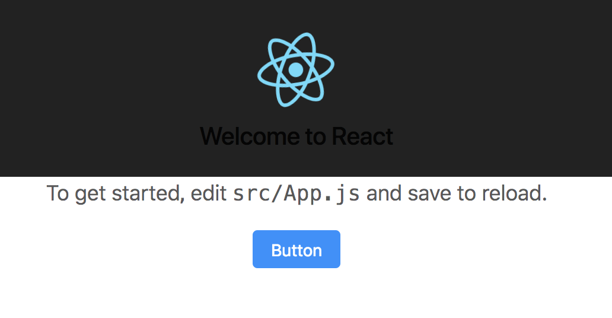

# 搭建React应用

React 起源于 [Facebook](https://www.facebook.com/) 的内部项目，用来架设 Instagram 的网站，并于 2013 年 5 月开源。是一个用于构建用户界面的 JAVASCRIPT 库。拥有较高的性能，代码逻辑非常简单，越来越多的人已开始关注和使用它。

React 特点

1. 声明式设计 − React采用声明范式，可以轻松描述应用。
2. 高效 − React通过对DOM的模拟，最大限度地减少与DOM的交互。
3. 灵活 − React可以与已知的库或框架很好地配合。
4. JSX − JSX 是 JavaScript 语法的扩展。React 开发不一定使用 JSX ，但我们建议使用它。
5. 组件 − 通过 React 构建组件，使得代码更加容易得到复用，能够很好的应用在大项目的开发中。
6. 单向响应的数据流（Redux） − 实现单向响应的数据流，从而减少了重复代码，这也是它为什么比传统数据绑定更简单。

## 创建一个项目

在创建项目前需要安装`create-react-app`脚手架，以辅助初始化一个默认的React项目模版。

```bash
#全局安装create-react-app
yarn add create-react-app -g

#创建项目demo
#会自动安装 react, react-dom, and react-scripts等库
create-react-app demo
```

这样，一个最简单的React项目就搭建完成了。之后，就可以通过下面的命令来预览网站了。

```bash
#进入项目目录
cd demo

#启动网站
yarn start
```

不出意外，您将看到下图的网站启动地址，而且会自动调起浏览器加载该网站。


## 使用UI框架

由于`create-react-app`生成的最简单的模版，为了屏蔽不必要的设计差异和实现成本，解放设计和前端的研发资源，我们这里使用了前端 UI 设计语言[ant design](https://ant.design/docs/react/introduce-cn)。

```bash
#添加antd依赖
yarn add antd
```

修改 src/App.js，引入 antd 的按钮组件。

```js
···
import Button from 'antd/lib/button';

···
    <Button type="primary">Button</Button>
···
```

修改 src/App.css，在文件顶部引入 antd/dist/antd.css。

```css
@import '~antd/dist/antd.css';

.App {
  text-align: center;
}

...
```

这个时候重新查看网站，发现页面里有了ant样式的按钮控件了。


## 打包器Webpack

webpack 是一个现代 JavaScript 应用程序的静态模块打包器(module bundler)。当 webpack 处理应用程序时，它会递归地构建一个依赖关系图(dependency graph)，其中包含应用程序需要的每个模块，然后将所有这些模块打包成一个或多个 bundle。

安装webpack webpack-cli

```bash
yarn add webpack webpack-cli -D
```

在根目录下创建configs目录，新建webpack.config.dev.js，并添加以下内容

```js
const path = require ('path');
const environment = 'development';

process.env.BABEL_ENV = environment;
process.env.NODE_ENV = environment;

//向外暴露一个配置对象，commonjs规范（因为webpack是基于node构建）
//在webpack4中有一大特性是约定大于配置，默认打包入口路径是'src/index.js'，打包输出路径是'dist/main.js'
module.exports = {
  // entry:['./src/index.js'],
  mode: environment, //development|production ( 生产环境会将代码压缩 )
  output: {
    //配置文件输出路径
    filename: 'main.js',
    path: path.resolve (__dirname, 'dist'),
  },
  module: {
    //webpack默认只能打包处理.js后缀的文件，像.jpg .vue等文件无法主动处理，所以需要配置第三方loader
    rules: [
    ],
  },
};
```

然后，修改`package.json`文件中`scripts`对象

```json
  "scripts": {
    "start": "webpack --config configs/webpack.config.dev.js",
  }
```

这个时候如果直接运行`yarn start`，则会报错，因为react使用jsx语法实现的，需要引入Babel库进行转码之后才能被浏览器识别和执行。

## 使用Babel

安装`babel-core babel-loader babel-preset-es2015 babel-preset-react-app`解析js文件

```bash
yarn add babel-core babel-loader babel-preset-es2015 babel-preset-react-app -D
```

   在`webpack.config.dev.js`文件中添加以下内容

```js
···
module: {
    rules: [
      // 解析js|jsx文件
      {
        test: /\.(js|jsx)$/,
        use: 'babel-loader',
        // 在使用babel-loader时候一定要加上exclude,排除node_modules文件夹
        exclude: /node_modules/,
      },
    ]
}
```

安装`css-loader`解析css文件

```bash
yarn add css-loader -D
```

在`webpack.config.dev.js`文件中添加以下内容

```js
···
module: {
    rules: [
      // 解析js|jsx文件
      ···
      // 解析css文件
      {
        test: /\.css$/,
        // use从右往左写
        use: ['css-loader'],
      },
    ]
}
```

安装`url-loader file-loader`解析图片文件

```bash
yarn add url-loader file-loader -D
```

在`webpack.config.dev.js`文件中添加以下内容

```js
···
module: {
    rules: [
      // 解析js|jsx文件
      ···
      // 解析css文件
      ···
      //解析图片文件
      {
        test: /\.(gif|png|jpg|woff|svg|ttf|eot)$/,
        use: [
          {
            loader: 'url-loader',
            options: {
              //当图片小于这个值他会生成一个图片的url 如果是一个大于的他会生成一个base64的图片在js里展示
              limit: 1024,
              //指定打包后的图片位置
              outputPath: 'iamges/',
              name: '[name].[ext]?[hash]',
            },
          },
        ],
      },
    ]
}
```

这个时候再运行`yarn start`，就可以看到webpack对项目资源的打包过程，并且在根目录下出现了打包后的dist文件夹。但是仅仅是一些资源文件被打包的，这个时候无法直接浏览页面内容，因为dist文件夹中没有html文件。




另外为了提高打包编译的速度和浏览器下载资源的速度，可以通过添加`babel-plugin-import`插件来只加载需要的组件，实现按需加载组件。

```bash
#添加babel-plugin-import
#-D|--dev 插件被写入到 devDependencies 对象里面去
#devDependencies 里面的插件只用于开发环境，不用于生产环境，而 dependencies 是需要发布到生产环境的。
yarn add babel-plugin-import -D
```

在项目的根目录下添加`.babelrc`文件，并添加以下内容

```json
{
    "presets": [
        "es2015",
        "react-app"
    ],
    "plugins": [
        [
            "import",
            {
                "libraryName": "antd",
                "style": "css"
            }
        ]
    ]
}
```

现在插件会帮你转换成 antd/lib/xxx 的写法了，同时因为设置了 style 属性，模块样式也可以按需自动加载，不需要再手动引入css或less文件了。

`src/App.js`修改为

```js
-   import Button from 'antd/lib/button';
+   import { Button } from 'antd';
```

`src/App.css`移除antd.css

```css
-   @import '~antd/dist/antd.css'
```

## react

## react-router

## redux

## antd

## babel

## eslint

## style

## webpack

## jest

## 写在最后