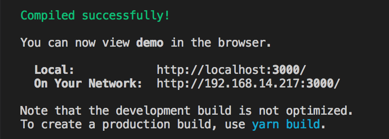

# 搭建React应用

React 起源于 [Facebook](https://www.facebook.com/) 的内部项目，用来架设 Instagram 的网站，并于 2013 年 5 月开源。是一个用于构建用户界面的 JAVASCRIPT 库。拥有较高的性能，代码逻辑非常简单，越来越多的人已开始关注和使用它。

React 特点

1. 声明式设计 − React采用声明范式，可以轻松描述应用。
2. 高效 − React通过对DOM的模拟，最大限度地减少与DOM的交互。
3. 灵活 − React可以与已知的库或框架很好地配合。
4. JSX − JSX 是 JavaScript 语法的扩展。React 开发不一定使用 JSX ，但我们建议使用它。
5. 组件 − 通过 React 构建组件，使得代码更加容易得到复用，能够很好的应用在大项目的开发中。
6. 单向响应的数据流（Redux） − 实现单向响应的数据流，从而减少了重复代码，这也是它为什么比传统数据绑定更简单。

## 创建一个项目

在创建项目前需要安装`create-react-app`脚手架，以辅助初始化一个默认的React项目模版。

```bash
#全局安装create-react-app
yarn add create-react-app -g

#创建项目demo
#会自动安装 react, react-dom, and react-scripts等库
create-react-app demo
```

这样，一个最简单的React项目就搭建完成了。之后，就可以通过下面的命令来预览网站了。

```bash
#进入项目目录
cd demo

#启动网站
yarn start
```

不出意外，您将看到下图的网站启动地址，而且会自动调起浏览器加载该网站。



## 使用UI框架

由于`create-react-app`生成的是最简单的模版，为了屏蔽不必要的设计差异和实现成本，解放设计和前端的研发资源，我们这里使用了前端 UI 设计语言[ant design](https://ant.design/docs/react/introduce-cn)。

```bash
#添加antd依赖
yarn add antd
```

修改 src/App.js，引入 antd 的按钮组件。

```js
···
import Button from 'antd/lib/button';

···
    <Button type="primary">Button</Button>
···
```

修改 src/App.css，在文件顶部引入 antd/dist/antd.css。

```css
@import '~antd/dist/antd.css';

.App {
  text-align: center;
}

...
```

这个时候重新查看网站，发现页面里有了ant样式的按钮控件了。


## 打包器Webpack

webpack 是一个现代 JavaScript 应用程序的静态模块打包器(module bundler)。当 webpack 处理应用程序时，它会递归地构建一个依赖关系图(dependency graph)，其中包含应用程序需要的每个模块，然后将所有这些模块打包成一个或多个 bundle。

安装webpack webpack-cli

```bash
#-D|--dev 插件被写入到 devDependencies 对象里面去
#devDependencies 里面的插件只用于开发环境，不用于生产环境，而 dependencies 是需要发布到生产环境的。
yarn add webpack webpack-cli -D
```

在根目录下创建scripts目录，新建webpack.config.dev.js，并添加以下内容

```js
const path = require ('path');
const environment = 'development';

process.env.BABEL_ENV = environment;
process.env.NODE_ENV = environment;

//向外暴露一个配置对象，commonjs规范（因为webpack是基于node构建）
//在webpack4中有一大特性是约定大于配置，默认打包入口路径是'src/index.js'，打包输出路径是'dist/main.js'
module.exports = {
  // entry:['./src/index.js'],
  mode: environment, //development|production ( 生产环境会将代码压缩 )
  output: {
    //配置文件输出路径
    filename: 'main.js?[hash]',
    path: path.resolve (__dirname, '../dist'),
  },
  module: {
    //webpack默认只能打包处理.js后缀的文件，像.jpg .vue等文件无法主动处理，所以需要配置第三方loader
    rules: [
    ],
  },
};
```

然后，修改`package.json`文件中`scripts`对象

```json
  "scripts": {
    "start": "webpack --config scripts/webpack.config.dev.js",
  }
```

这个时候如果直接运行`yarn start`，则会报错，因为react使用jsx语法实现的，需要引入Babel库进行转码之后才能被浏览器识别和执行。

## 使用Babel

安装`babel-core babel-runtime babel-loader babel-preset-es2015 babel-preset-react-app`解析js文件

```bash
yarn add babel-core babel-runtime babel-loader babel-preset-es2015 babel-preset-react-app -D
```

   在`webpack.config.dev.js`文件中添加以下内容

```js
···
module: {
    rules: [
      // 解析js|jsx文件
      {
        test: /\.(js|jsx)$/,
        use: 'babel-loader',
        // 在使用babel-loader时候一定要加上exclude,排除node_modules文件夹
        exclude: /node_modules/,
      },
    ]
}
```
## 样式解析器

安装`css-loader less less-loader node-sass sass-loader`解析css文件，安装`mini-css-extract-plugin`插件独立打包css文件。

```bash
#可能出现无法下载node-sass问题，请使用淘宝镜像，并使用npm i node-sass -D尝试解决
yarn add css-loader less less-loader node-sass sass-loader mini-css-extract-plugin -D
```

在`webpack.config.dev.js`文件中添加以下内容

```js
const path = require ('path');
const MiniCssExtractPlugin = require ('mini-css-extract-plugin');

//创建一个MiniCssExtractPlugin插件实例
const cssPlugin = new MiniCssExtractPlugin ({
  filename: 'index.css',
});

module.exports = {
  ···
  plugins: [cssPlugin],
  module: {
      rules: [
          ···
          // 解析css文件
          {
              test: /\(.css|less|sass|scss)$/,
              // use从右往左写
              use: [MiniCssExtractPlugin.loader, 'css-loader','less-loader','sass-loader'],
          },
          ···
      ],
  },
···
```

## 资源文件
安装`url-loader file-loader`解析图片文件，安装`html-webpack-plugin`插件自动根据模板生成html文件

```bash
yarn add url-loader file-loader html-webpack-plugin -D
```

在`webpack.config.dev.js`文件中添加以下内容

```js
const path = require ('path');
const HtmlWebpackPlugin = require ('html-webpack-plugin');
const MiniCssExtractPlugin = require ('mini-css-extract-plugin');

//创建一个HtmlWebpackPlugin插件实例
const htmlPlugin = new HtmlWebpackPlugin ({
  title: 'react-demo',
  //模板文件
  template: path.join (__dirname, '../public/index.html'),
  //生成文件名
  filename: 'index.html',
  favicon: path.join (__dirname, '../public/favicon.ico'),
  minify: {
    // 移除属性的引号
    removeAttributeQuotes: true, 
  },
});

//创建一个MiniCssExtractPlugin插件实例
const cssPlugin = new MiniCssExtractPlugin ({
  filename: 'index.css',
});

module.exports = {
  ···
  plugins: [htmlPlugin, cssPlugin],
  module: {
    rules: [
      // 解析js|jsx文件
      ···
      // 解析css文件
      ···
      //解析图片文件
      {
        test: /\.(gif|png|jpg|woff|svg|ttf|eot)$/,
        use: [
          {
            loader: 'url-loader',
            options: {
              //当图片小于这个值他会生成一个图片的url 如果是一个大于的他会生成一个base64的图片在js里展示
              limit: 1024,
              //指定打包后的图片位置
              outputPath: 'images/',
              name: '[name].[ext]?[hash]',
            },
          },
        ],
      },
    ]
}
```
## 按需加载
另外为了提高打包编译的速度和浏览器下载资源的速度，可以通过添加`babel-plugin-import`插件来只加载需要的组件，实现按需加载组件。

```bash
#添加babel-plugin-import
yarn add babel-plugin-import -D
```

在项目的根目录下添加`.babelrc`文件，并添加以下内容

```json
{
    "presets": [
        "es2015",
        "react-app"
    ],
    "plugins": [
        [
            "import",
            {
                "libraryName": "antd",
                "style": "css"
            }
        ]
    ]
}
```

现在插件会帮你转换成 antd/lib/xxx 的写法了，同时因为设置了 style 属性，模块样式也可以按需自动加载，不需要再手动引入css或less文件了。

`src/App.js`修改为

```js
-   import Button from 'antd/lib/button';
+   import { Button } from 'antd';
```

`src/App.css`移除antd.css

```css
-   @import '~antd/dist/antd.css'
```
## 热更新
虽然我们完成了打包，并且可以在浏览器中访问网站，但是每次重新构建之后需要手动刷新index.html，才能得到最新的效果，开发效率极低。但是，`webpack-dev-server`可以帮助我们解决这个问题，它是一个小型的静态文件服务器，为webpack打包的资源文件提供Web服务。并且提供自动刷新和`Hot Module Replacement`（模块热替换：前端代码变动后无需刷新整个页面，只把变化的部分替换掉）。

```bash
#添加webpack-dev-server
yarn add webpack-dev-server -D
```
在`webpack.config.dev.js`文件中添加以下内容

```js
···
  module: {
    ···
  },
  devServer: {
      port: 3000, //如果省略，默认8080
      //默认会以根文件夹提供本地服务器，这里指定文件夹
      contentBase: path.resolve(__dirname, '../dist'),
      publicPath: "/",
      historyApiFallback: {
          // Paths with dots should still use the history fallback.
          disableDotRule: true,
      },
  }
```
## 代码检测工具

ESLint最初是由[Nicholas C. Zakas](http://nczonline.net/)于2013年6月创建的开源项目。它的目标是提供一个插件化的javascript代码检测工具。


在项目的根目录下添加`.eslintrc.js`文件，并添加以下内容
```js
module.exports = {
  parser: 'babel-eslint',
  env: {
    browser: true,
    node: true,
    es6: true,
    jest: true,
  },
  plugins: ['react'],
  extends: ['plugin:react/recommended'],
  rules: {
    quotes: [1, 'single'],
    semi: [2, 'always'],
    'no-undef':2,
    'no-param-reassign': 0,
    'no-constant-condition': 2,
    'no-unused-vars': 2,
    'no-console': 1,
    'no-use-before-define': 2,
    'no-trailing-spaces': [1, {skipBlankLines: true}],
    'linebreak-style': [2, 'unix'],
    'arrow-body-style': [2, 'as-needed'],
    'comma-dangle': [2, 'always-multiline'],
    'global-require': [1],
    'prefer-template': 2,
    'react/prop-types': 0,
    'react/jsx-first-prop-new-line': [2, 'multiline'],
    'react/jsx-filename-extension': [1, {extensions: ['.js']}],
  },
  parserOptions: {
    ecmaVersion: 6,
    sourceType: 'module',
    ecmaFeatures: {
      experimentalObjectRestSpread: true,
      jsx: true,
    },
  },
  settings: {
    polyfills: ['fetch', 'promises'],
  },
};
```

## redux

## jest

## 写在最后